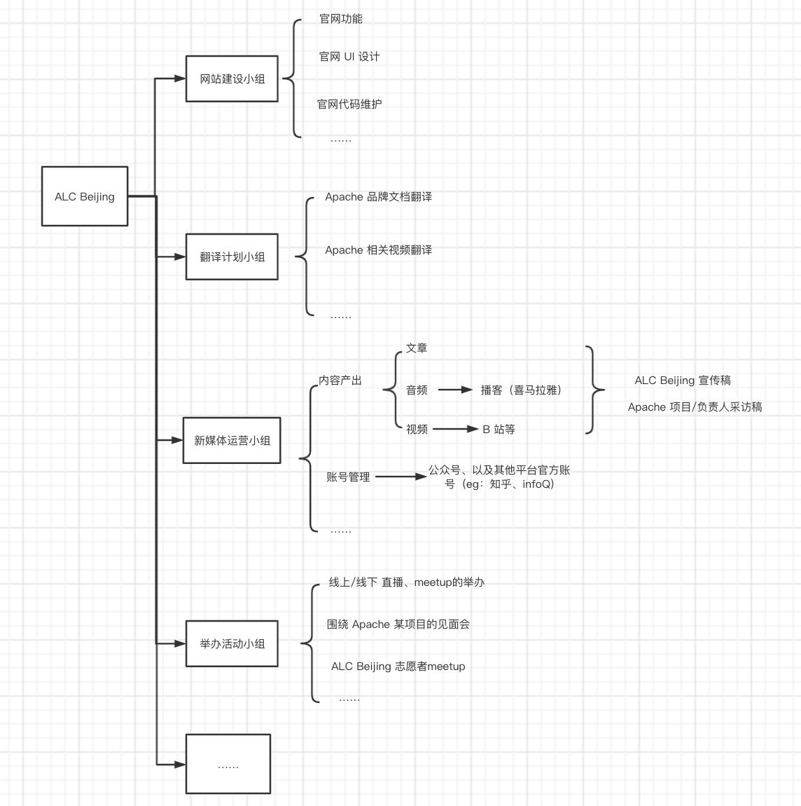

# ALC Beijing 社区规则

## ALC Beijing 
Apache Local Community 是由一群分布在各地开源爱好者，尤其是 Apache（开源）爱好者（Group）所组成。因为是本地组织，ALC 是按照城市或地区的方式进行划分的，所以 ALC Beijing 是北京 Apache 开源爱好者社区。

## ALC Beijing SIG 
ALC Beijing 为大家提供不同的特别兴趣小组（SIG），不同的 SIG 小组对应不同领域的志愿工作，如：网站建设、翻译、新媒体运营等。每个小组的规则大家共建、自治管理，小组长带领大家提出本组的规则、工作内容等，但最终提案需要经过 ALC Beijing 管理委员会同意。

**ALC Beijing SIG 架构图**

## ALC Beijing 社区体系
ALC Beijing 社区设置 3 类角色：管理委员会成员、各小组组长、社区贡献者。

### 管理委员会
管理委员会旨在把控 ALC Beijing 社区整体发展方向，对各小组的提案有决定权，保证每个重要提案是对 ALC Beijing 的发展是正向的，对 Apache 文化宣传是正确的。

**管理委员会有哪些权利？**
- 对新委员的加入有投票权
- 对各小组的重要提案有决定权

**如何成为管理委员会成员？**
- 各小组的组长自动进入管理委员会
- 申请加入，由管理委员会成员投票决定是否通过

### 组长
活跃的贡献者，负责各组工作规则、工作内容、发展方向等制定，组织组内的工作。

**如何成为小组长？**
建立之初，希望大家自荐。未来通过每年竞选，管理委员会成员投票决定

### 贡献者
做了贡献就是社区的贡献者啦：）

### 奖励制度
#### 积分奖励
每个小组都有自己要做的事情，根据小组规则，完成对应工作可获得积分。积分可兑换奖励列表中的奖励。

| 社区工作	| 积分 |
|---|---|
|翻译	|x 分|
|官网建设	|y 分|
|公众号	|z 分|
|……|	……|

|奖励列表 |	积分|
|---|---|
|Apache 马克杯|	a 分|
|Apache T 恤|	b 分|
|Apache 徽章|	c 分|
|……	|……|

[历史贡献者积分统计]()

#### 荣誉贡献者
除了积分奖励，ALC Beijing 每季度&每年还会评选为社区做出重大贡献的荣誉贡献者，**为荣誉贡献者颁发证书，并给予一定的特权**，包含但不限于：与 Apache 项目 VP 1v1 沟通机会、ALC Beijing 年底圆桌会议邀请等。

## 欢迎反馈
这是社区第一版规则，还有许多疏漏之处，欢迎大家提出疑问、想法和建议，让我们一起把社区规则建设起来，完善得越来越好。

